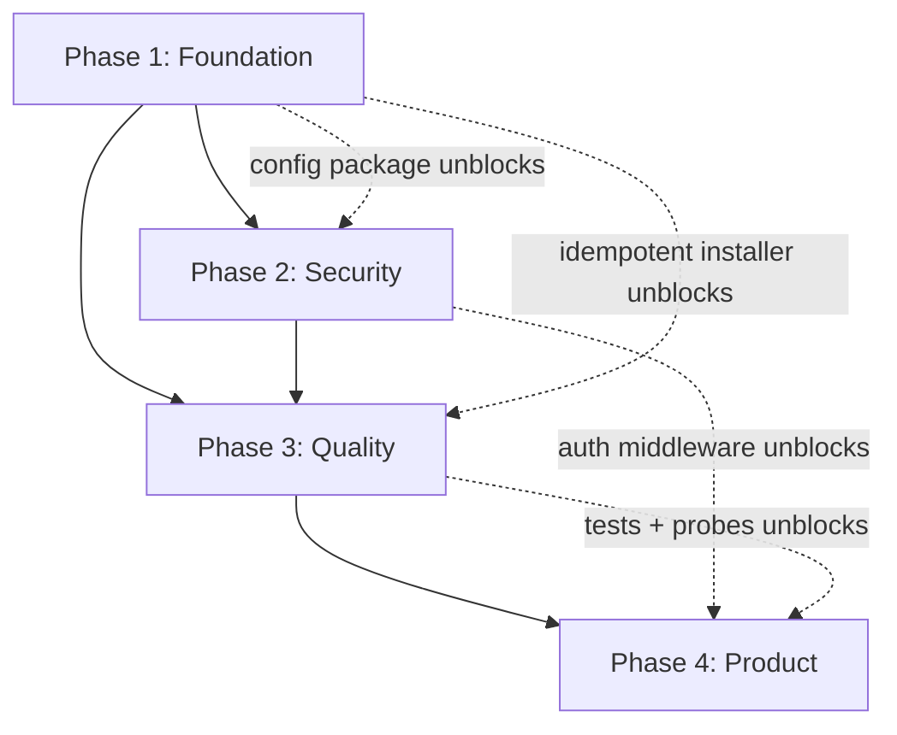

# TrinityProxy Roadmap

> Actionable implementation plan derived from a full codebase audit (Aug 2026).
> Each task includes files to touch, acceptance criteria, dependencies, and effort estimates.
> Use the checkboxes to track progress.

---

## Executive Summary

TrinityProxy is a **Controller–Agent SOCKS5 proxy network** with working core pieces: Dante installer, SQLite node registry, heartbeat ingestion, REST API with auth, and non-root systemd services. Ready for greenfield master + agent deployment when production keys are set.

### Current State (validated against code — updated after Phase 3 complete, Aug 2026)

| Area | Status | Evidence |
|------|--------|----------|
| Agent installer | **Idempotent** | `installer.go` reuses `/etc/trinityproxy-*`; root required for first install only |
| Heartbeat | **Resilient + authenticated** | Geo failure → `"Unknown"`; ISO country codes; `TRINITY_AGENT_KEY` when set |
| API server | **:3100 with auth** | Public DTOs omit passwords; country filter accepts code or name |
| Database | SQLite with **zip** + ISO countries | `database.go`; 5-min offline timeout; schema migration on startup |
| Dante SOCKS5 | Auth-only template | `socksmethod: username` only |
| Systemd | **Non-root runtime** | Controller: `trinityproxy`; agent: `trinityproxy-agent` |
| CLI client | **Removed** | Planned Phase 4 (dashboard) |
| Dashboard MVP | **Shipped** | `cmd/dashboard/` + `web/dashboard/` — auth, fleet UI, Deploy Agent, Settings, Cloudflare SSL modal |
| Tests | **71+ tests** | storage, agent, api, health, middleware, dashboard auth/deployment/stats |
| Observability | **slog + `/metrics`** | JSON logs; heartbeats, nodes_online, probe_failures counters |
| LICENSE | **Present** | MIT `LICENSE` at repo root |
| Docs | **Reconciled** | README + MISSING_COMPONENTS |

### Phase 1 Sprint 1 Status (complete)

| Task | Status | Notes |
|------|--------|-------|
| 1.2 Idempotent installer | ✅ Done | |
| 1.4 Non-interactive systemd | ✅ Done | |
| 1.1 Centralize configuration | ✅ Done | Env: `CONTROLLER_URL`, `API_PORT`, `DB_PATH`, `HEARTBEAT_INTERVAL` |
| 1.3 Compiled binaries | ✅ Done | Controller + installer use `build/*` binaries |
| 1.5 Unify binary naming | ✅ Done | Canonical: `build/trinityproxy-api`, `build/installer`, `build/trinityproxy` |
| 1.6 Remove anonymous SOCKS | ✅ Done | |
| 1.7 Reconcile documentation | ✅ Done | |
| 1.8 Add LICENSE | ✅ Done | |

**Smoke test (post-sprint):** `go build ./...` ✅ · `go test ./...` ✅ (no test files)

### Phase 2 Sprint 2 Status (complete)

| Task | Status | Notes |
|------|--------|-------|
| 2.1 API key middleware | ✅ Done | `TRINITY_API_KEY`, `TRINITY_AGENT_KEY`; dev mode when unset |
| 2.2 Public vs admin views | ✅ Done | No passwords on public GET; `/api/nodes/admin` for full creds |
| 2.4 cleanup.sh | ✅ Done | Agent + controller + legacy services; `--yes` flag |
| 2.3 Non-root systemd | ✅ Done | `trinityproxy` / `trinityproxy-agent` users; install via sudo once |

**Smoke test (post-sprint):** `go build ./...` ✅ · `/health` open · `/api/nodes` 401 without key · no password in public JSON

### Phase 3a Sprint 3 Status (complete)

| Task | Status | Notes |
|------|--------|-------|
| 3.6 Graceful geo failure | ✅ Done | Heartbeat continues with `"Unknown"` geo fields |
| 3.5 Persist zip | ✅ Done | `zip` column + API DTOs |
| 3.4 Normalize country codes | ✅ Done | `internal/geo/country.go`; ISO ingest + dual query match |
| 3.1 Storage unit tests | ✅ Done | 6 tests in `database_test.go` |
| 3.3 Geo fallback tests | ✅ Done | 10 tests in `identity_test.go` |

**Smoke test (post-sprint):** `go build ./...` ✅ · `go test ./...` ✅ (16 tests at Phase 3a close; now 71+ repo-wide)

### Phase 3b Sprint 3 Status (complete)

| Task | Status | Notes |
|------|--------|-------|
| 3.2 API handler tests | ✅ Done | 16 handler + 5 middleware tests |
| 3.7 SOCKS health probes | ✅ Done | On-demand + background loop (`PROBE_INTERVAL`); `is_healthy` in DB/API |
| 3.8 slog + metrics | ✅ Done | JSON slog, open `GET /metrics` |

**Smoke test (post-sprint):** `go build ./...` ✅ · `go test ./...` ✅ (71+ tests across all packages)

### Critical Blockers (remaining — Phase 4)

1. ~~Default `CONTROLLER_URL` hardcoded~~ — resolved: dashboard deployment settings + env
2. ~~Master dashboard + agent bootstrap script~~ — Task 4.5 MVP complete

### Target Timeline

| Phase | Focus | Duration |
|-------|-------|----------|
| 1 | Foundation | ~1 week | **Sprint 1 complete** |
| 2 | Security | ~1 week | **Sprint 2 complete** |
| 3 | Quality | ~1–2 weeks | **Complete** |
| 4 | Product | Multi-sprint | **4.5 MVP complete**; 4b in progress (partial 4.6–4.11) |

### Phase 4 Smoke Test (Aug 2026 — 4-agent audit)

Full-system smoke test across dashboard frontend/backend, agent/controller, and infra/docs.

| Area | Result | Notes |
|------|--------|-------|
| Dashboard frontend | **PASS** | `npm run build` clean; all 6 routes; API client aligned; no nginx/letsencrypt UI |
| Dashboard backend | **PASS** | 17/17 dashboard unit tests; 16 API routes live on `:8081` |
| Agent ↔ controller | **PASS** (1 defect fixed) | Heartbeat + `TRINITY_AGENT_KEY` auth; `platform`/`device_class`/`network_type` flow to API |
| SSL / Caddy / Cloudflare | **PASS** | `setup-ssl-caddy-cloudflare.sh` wired to Settings modal; DNS-01 wildcard + proxied records |
| Infra / docs | **PARTIAL** | nginx references remain in README/Makefile/MISSING_COMPONENTS; `make vps-setup` broken |

**Known defects / loose ends (post-smoke):**

- [x] `install-agent-windows.ps1` — duplicate `Test-NonInteractive` / missing `Resolve-SourceBinary` (**fixed Aug 2026**)
- [ ] `make vps-setup` blocks on deprecated `setup-api-controller` (foreground controller; never reaches SSL/systemd)
- [ ] README / MISSING_COMPONENTS still mention nginx; production path should document **Caddy + Cloudflare modal**
- [ ] `provision-ssl` uses relative script path + `sudo` (VPS-only; fails on macOS dev without root)
- [ ] No dashboard HTTP handler integration tests
- [ ] Dead code: `fetchBootstrapScript` in frontend (Deploy uses `deploy-commands` instead)
- [ ] Auto-refresh on node views not implemented (manual Refresh only)
- [ ] Task 4.6 partial: `asn`/`org` not on heartbeat; Task 4.7 `ip_class` not started
- [x] Windows/macOS embedded SOCKS (`internal/proxy/` — RFC 1929, default `:1080`; macOS `make run-agent-dev`, Windows install script)

---

## Phase Dependencies

---

## Phase 1 — Foundation (~1 week)

**Goal:** Make deployable, configurable, and documented without changing product features.

### Definition of Done

- [x] All runtime values (controller URL, API port, DB path, heartbeat interval) configurable via env or config file
- [x] Agent restart preserves credentials and Dante config
- [x] Controller and agent systemd services start non-interactively with compiled binaries
- [x] Binary names consistent across Makefile, scripts, and docs
- [x] README and MISSING_COMPONENTS accurately reflect code
- [x] Anonymous SOCKS removed from Dante template

---

### Task 1.1 — Centralize configuration

**Description:** Introduce a small config layer (env vars with sensible defaults). Wire all hardcoded values through it.

| | |
|---|---|
| **Files** | New: `internal/config/config.go`; edit: `internal/agent/heartbeat.go`, `cmd/api/enhanced_main.go`, `main.go` |
| **Env vars** | `CONTROLLER_URL`, `TRINITY_API_PORT` (default `3100`), `TRINITY_DB_PATH` (default `./trinityproxy.db`), `TRINITY_HEARTBEAT_INTERVAL` (default `60s`) |
| **Acceptance criteria** | Setting `CONTROLLER_URL=http://my-server:3100` causes agent heartbeats to hit that URL; API listens on configured port; DB path configurable; interval respected |
| **Dependencies** | None |
| **Effort** | 4–6 hours |

- [x] Create `internal/config/config.go` with env parsing and defaults
- [x] Replace `controlAPIURL` const in `heartbeat.go` with config
- [x] Replace hardcoded `:3100` and `./trinityproxy.db` in `enhanced_main.go`
- [x] Document env vars in README

---

### Task 1.2 — Make installer idempotent

**Description:** Skip credential generation and Dante reconfiguration if `/etc/trinityproxy-*` files already exist. Only run full install on first boot or when `--force` flag passed.

| | |
|---|---|
| **Files** | `cmd/installer/installer.go`, `main.go` |
| **Acceptance criteria** | Second agent start (or systemd restart) reuses existing username/password/port; `/etc/danted.conf` not overwritten unless `--force`; installer logs "using existing credentials" |
| **Dependencies** | None (highest priority blocker) |
| **Effort** | 3–4 hours |

- [x] Add `credentialsExist()` check for `usernamePath`, `passwordPath`, `portPath`
- [x] Add `readExistingCredentials()` to load from files
- [x] Gate `generateCredentials()` behind existence check
- [x] Optionally skip `writeDanteConf` if conf exists and credentials unchanged
- [x] Add `--force` flag for intentional reinstall

---

### Task 1.3 — Use compiled binaries, not `go run`

**Description:** `main.go` execs compiled `build/installer` and `build/trinityproxy-api` (no `go run` at runtime).

| | |
|---|---|
| **Files** | `main.go`, `scripts/trinityproxy-controller.service`, `scripts/trinityproxy-agent.service` |
| **Acceptance criteria** | `TRINITY_ROLE=controller ./build/trinityproxy` starts API without Go toolchain at runtime; agent calls `./build/installer` not `go run`; systemd unit files reference compiled paths |
| **Dependencies** | Task 1.5 (naming) |
| **Effort** | 2–3 hours |

- [x] Change `runInstaller()` to exec `build/installer` (resolve path relative to binary or `TRINITY_ROOT`)
- [x] Change `runAPIController()` to exec `build/trinityproxy-api` directly
- [x] Update `trinityproxy-controller.service` template to match `install-service.sh` output

---

### Task 1.4 — Fix systemd non-interactive startup

**Description:** `main.go` prompts `[?] Use existing role? (Y/n)` even when `TRINITY_ROLE` is preset. Systemd agent service sets the env var but stdin is closed → service hangs or fails.

| | |
|---|---|
| **Files** | `main.go` |
| **Acceptance criteria** | When `TRINITY_ROLE` is set and stdin is not a TTY (or `TRINITY_NONINTERACTIVE=1`), skip all prompts and start immediately; `systemctl start trinityproxy-agent` succeeds without user input |
| **Dependencies** | None |
| **Effort** | 1–2 hours |

- [x] Detect non-interactive mode: `!term.IsTerminal(int(os.Stdin.Fd()))` or env flag
- [x] Skip role confirmation and shell-profile persistence prompts in non-interactive mode
- [x] Verify agent systemd unit sets `TRINITY_NONINTERACTIVE=1` (optional belt-and-suspenders)

---

### Task 1.5 — Unify binary naming

**Description:** Makefile builds `build/trinityproxy-api`. All scripts and `main.go` use the same canonical names.

| | |
|---|---|
| **Files** | `Makefile`, `scripts/install-service.sh`, `scripts/trinityproxy-controller.service`, docs |
| **Recommendation** | `build/trinityproxy-api` for API, `build/trinityproxy` for main, `build/installer` for installer |
| **Acceptance criteria** | Single canonical name per binary; `make build` and `make install-service` produce same paths; no references to alternate names |
| **Dependencies** | None |
| **Effort** | 1–2 hours |

- [x] Rename `API_BINARY` in Makefile to `build/trinityproxy-api`
- [x] Align `install-service.sh` with Makefile target
- [x] Grep repo for stale `build/api` references and update

---

### Task 1.6 — Remove anonymous SOCKS from Dante config

**Description:** `installer.go` sets `socksmethod: username none` and includes a `socksmethod: none` pass block. Remove anonymous access.

| | |
|---|---|
| **Files** | `cmd/installer/installer.go` |
| **Acceptance criteria** | Generated `/etc/danted.conf` requires username auth only; unauthenticated SOCKS connection to agent port fails; authenticated connection succeeds |
| **Dependencies** | Task 1.2 (avoid overwriting existing conf on restart — use `--force` to apply to existing installs) |
| **Effort** | 1 hour |

- [x] Change `socksmethod: username none` → `socksmethod: username`
- [x] Remove the anonymous `socks pass { socksmethod: none }` block
- [x] Document that existing deployments need reinstall or manual conf edit

---

### Task 1.7 — Reconcile documentation

**Description:** Align README and MISSING_COMPONENTS with actual code behavior.

| | |
|---|---|
| **Files** | `README.md`, `MISSING_COMPONENTS.md` |
| **Known drift** | Port 8080 → 3100; `/nodes` → `/api/nodes`; heartbeat 30s → 60s; CLI client removed |
| **Acceptance criteria** | Every endpoint, port, interval, and file path in docs matches code; MISSING_COMPONENTS no longer lists CLI as implemented; removed components listed under "Missing" |
| **Dependencies** | Tasks 1.1, 1.5 (so docs reflect final config and naming) |
| **Effort** | 3–4 hours |

- [x] Update API endpoint table (port 3100, `/api/*` paths)
- [x] Fix heartbeat interval to 60s
- [x] Remove CLI client from "Implemented" in MISSING_COMPONENTS; add to Phase 4 backlog
- [x] Replace hardcoded production URL examples with configurable placeholder
- [x] Add ROADMAP.md link from README

---

### Task 1.8 — Add LICENSE file

**Description:** README claims MIT license but no `LICENSE` file exists.

| | |
|---|---|
| **Files** | New: `LICENSE` |
| **Acceptance criteria** | Standard MIT LICENSE present at repo root; README link resolves |
| **Dependencies** | None |
| **Effort** | 15 minutes |

- [x] Add MIT LICENSE with correct copyright holder

---

## Phase 2 — Security (~1 week)

**Goal:** Protect credentials and API surface; harden service accounts.

### Definition of Done

- [x] API endpoints require authentication (except `/health`)
- [x] Public node listing never returns passwords
- [x] Systemd services run as dedicated non-root users where feasible
- [x] Cleanup script handles current service names

---

### Task 2.1 — API key middleware

**Description:** Require `Authorization: Bearer <key>` or `X-API-Key` header on mutating and listing endpoints. Heartbeat uses a separate agent key.

| | |
|---|---|
| **Files** | New: `internal/api/middleware.go`; `cmd/api/enhanced_main.go`, `internal/config/config.go` |
| **Env vars** | `TRINITY_API_KEY` (client access), `TRINITY_AGENT_KEY` (heartbeat ingestion) |
| **Acceptance criteria** | Unauthenticated GET `/api/nodes` returns 401; valid key returns 200; heartbeat without agent key returns 401; `/health` remains open |
| **Dependencies** | Phase 1 Task 1.1 (config) |
| **Effort** | 4–6 hours |

- [x] Implement middleware with constant-time key comparison
- [x] Apply to `/api/nodes`, `/api/nodes/country`, `/api/nodes/random`
- [x] Apply agent key to `/api/heartbeat`
- [x] Document key generation and env setup

---

### Task 2.2 — Separate public vs admin node views

**Description:** Stop returning passwords on public GET. Define response DTOs: `NodePublic` (no password) and `NodeAdmin` (full details, key-gated).

| | |
|---|---|
| **Files** | `cmd/api/enhanced_main.go`, new: `internal/api/types.go` or extend `internal/storage/database.go` |
| **Acceptance criteria** | Default GET responses omit `password` field; admin endpoint or elevated key returns full credentials; JSON schema documented |
| **Dependencies** | Task 2.1 |
| **Effort** | 3–4 hours |

- [x] Create `ProxyNodePublic` struct without password
- [x] Map storage nodes to public DTO in handlers
- [x] Optional: `GET /api/nodes/admin` with stricter key for full export

---

### Task 2.3 — Non-root systemd users

**Description:** Controller and agent services currently run as `User=root`. Create dedicated users with minimal permissions.

| | |
|---|---|
| **Files** | `scripts/trinityproxy-controller.service`, `scripts/trinityproxy-agent.service`, `scripts/install-service.sh`, `scripts/install-agent-service.sh`, `cmd/installer/installer.go` |
| **Acceptance criteria** | Services run as `trinityproxy` (controller) and `trinityproxy-agent` users; DB and credential files have correct ownership; installer still works (may need `CapabilityBoundingSet` or selective sudo for `/etc/` writes during install only) |
| **Dependencies** | Phase 1 complete |
| **Effort** | 6–8 hours (installer privilege model needs careful design) |

- [x] Create system users in install scripts
- [x] Move install-time root operations into installer invoked once with sudo
- [x] Runtime agent/controller processes drop to non-root
- [x] Set file permissions on DB, logs, credential files

---

### Task 2.4 — Update cleanup.sh for current service names

**Description:** `cleanup.sh` stops/removes `trinityproxy` service; current names are `trinityproxy-agent` and `trinityproxy-controller`.

| | |
|---|---|
| **Files** | `scripts/cleanup.sh` |
| **Acceptance criteria** | Cleanup stops/disables both agent and controller services; removes both unit files; optionally supports `TRINITY_NONINTERACTIVE=1` to skip prompts |
| **Dependencies** | None |
| **Effort** | 1–2 hours |

- [x] Stop/disable `trinityproxy-agent` and `trinityproxy-controller`
- [x] Remove both systemd unit files
- [x] Keep legacy `trinityproxy` cleanup for older installs
- [x] Add `--yes` flag for scripted cleanup

---

## Phase 3 — Quality (~1–2 weeks)

**Goal:** Test coverage, reliable node selection, observable operations.

### Definition of Done

- [x] Unit tests for storage, API handlers, and geo fallback
- [x] `/api/nodes/random` only returns probed-healthy nodes
- [x] Geo lookup failure does not block heartbeat
- [x] Structured logging and basic metrics endpoint

---

### Task 3.1 — Unit tests: storage layer

**Description:** Test UpsertNode, GetOnlineNodes, GetNodesByCountry, MarkOfflineNodes against in-memory or temp-file SQLite.

| | |
|---|---|
| **Files** | New: `internal/storage/database_test.go` |
| **Acceptance criteria** | `go test ./internal/storage/...` passes; covers upsert idempotency, offline marking after timeout, country filter |
| **Dependencies** | Phase 1 complete |
| **Effort** | 4–6 hours |

- [x] Test UpsertNode creates and updates
- [x] Test MarkOfflineNodes with mocked timestamps
- [x] Test GetNodesByCountry exact and normalized match

---

### Task 3.2 — Unit tests: API handlers

**Description:** httptest-based handler tests with mocked storage.

| | |
|---|---|
| **Files** | New: `cmd/api/enhanced_main_test.go` or `internal/api/handlers_test.go` |
| **Acceptance criteria** | Tests cover heartbeat POST, nodes GET, country filter, random selection, auth middleware (after Phase 2) |
| **Dependencies** | Tasks 2.1, 2.2 |
| **Effort** | 6–8 hours |

- [x] Mock NodeStorage interface for handler tests
- [x] Test invalid JSON, method not allowed, empty country param
- [x] Test password omitted from public responses

---

### Task 3.3 — Unit tests: geo fallback (mocked HTTP)

**Description:** Test `getGeoInfo` and `getGeoField` with httptest servers returning ipapi/ip-api/ipinfo response shapes.

| | |
|---|---|
| **Files** | New: `internal/agent/identity_test.go` |
| **Acceptance criteria** | Tests verify fallback chain when first service fails; field name normalization (`country_name`, `country`, `country_code`) |
| **Dependencies** | None |
| **Effort** | 4–6 hours |

- [x] Refactor HTTP client to injectable interface for testability
- [x] Test each geo service response format
- [x] Test all-services-fail error path

---

### Task 3.4 — Normalize country codes

**Description:** Geo services return mixed formats. Store ISO 3166-1 alpha-2 (`US`) in DB; accept both `US` and `United States` in API queries.

| | |
|---|---|
| **Files** | `internal/agent/identity.go`, `internal/storage/database.go`, `cmd/api/enhanced_main.go`; optional: `internal/geo/country.go` |
| **Acceptance criteria** | Heartbeat stores `US` regardless of geo service; `?country=US` and `?country=United%20States` both match; existing nodes migrated or dual-indexed |
| **Dependencies** | Task 3.3 |
| **Effort** | 4–6 hours |

- [x] Map geo responses to ISO alpha-2 on ingest
- [x] Expand GetNodesByCountry to match code or name
- [x] Backfill script or migration for existing rows (N/A — greenfield; dual-match query handles legacy names)

---

### Task 3.5 — Persist zip/postal code

**Description:** `identity.go` collects `Zip` but `enhanced_main.go` drops it and schema has no column.

| | |
|---|---|
| **Files** | `internal/storage/database.go`, `cmd/api/enhanced_main.go`, `internal/agent/identity.go` |
| **Acceptance criteria** | `zip` column in DB; heartbeat persists zip; returned in node JSON |
| **Dependencies** | Phase 1 Task 1.1 |
| **Effort** | 2–3 hours |

- [x] Add `zip TEXT` column with migration (`ALTER TABLE` or recreate)
- [x] Extend `ProxyNode` struct and UpsertNode
- [x] Pass `meta.Zip` in heartbeat handler

---

### Task 3.6 — Graceful geo failure

**Description:** `GatherMetadata()` returns error if geo fails, blocking heartbeat entirely. Degrade gracefully: send heartbeat with `"Unknown"` geo fields.

| | |
|---|---|
| **Files** | `internal/agent/identity.go`, `internal/agent/heartbeat.go` |
| **Acceptance criteria** | Geo service outage does not prevent heartbeat; node registers with IP/port/credentials and `country: "Unknown"`; warning logged |
| **Dependencies** | None |
| **Effort** | 2 hours |

- [x] Change `getGeoInfo` failure to warn + empty map, not fatal
- [x] Ensure IP and credential reads still required (fail only if those missing)

---

### Task 3.7 — Real SOCKS5 health probes

**Description:** Before returning a node from `/api/nodes/random` (and optionally marking online), probe SOCKS5 connectivity with stored credentials.

| | |
|---|---|
| **Files** | New: `internal/health/socks_probe.go`; `cmd/api/enhanced_main.go`, `internal/storage/database.go` |
| **Acceptance criteria** | Random endpoint skips nodes failing TCP connect or SOCKS5 auth within timeout; probe result cached briefly (e.g. 30s) to avoid hammering; unit tests with mock dialer |
| **Dependencies** | Phase 2 (credentials access for admin/internal probe path) |
| **Effort** | 8–12 hours |

- [x] Implement SOCKS5 handshake probe (use `golang.org/x/net/proxy` or minimal implementation)
- [x] Filter in `handleGetRandomNode` before selection
- [x] Optional: background probe goroutine updating `last_probe_at` / `is_healthy`

---

### Task 3.8 — Structured logging + basic metrics

**Description:** Replace ad-hoc `log.Printf` with structured logger (slog). Expose Prometheus-style or simple JSON metrics endpoint.

| | |
|---|---|
| **Files** | All packages; new: `internal/metrics/metrics.go`; `cmd/api/enhanced_main.go` |
| **Acceptance criteria** | Logs are JSON with level, msg, component; `GET /metrics` returns node count, online count, heartbeat rate; no PII (passwords) in logs |
| **Dependencies** | Phase 1 |
| **Effort** | 6–8 hours |

- [x] Adopt `log/slog` with configurable format
- [x] Add counters: heartbeats received, nodes online, probe failures
- [x] Document log and metrics endpoints

---

## Phase 4 — Product (multi-sprint)

**Goal:** User-facing tools, intelligent routing, deployment automation, visibility, and **cross-platform agent support** (Linux, Windows, macOS — desktop/server only).

> **Out of scope (deferred):** Mobile agents (iOS / Android). No heartbeat, installer, or dashboard work for mobile in Phase 4. Revisit only if product direction changes.

### Definition of Done

- [ ] CLI client supports list, random, country, test commands
- [ ] Nodes ranked by health/latency; smart routing available
- [ ] Docker images and CI/CD pipeline
- [x] Web dashboard for node inventory and status
- [ ] Heartbeats include platform, device class, network type, ASN/org; stored and exposed via API *(platform/device/network ✅; asn/org ❌)*
- [ ] Server classifies nodes as residential vs datacenter (or unknown) on ingest
- [ ] Agents run on Linux (systemd + Dante), Windows (service), and macOS (native binary; dev without systemd/Dante) *(Linux ✅; macOS dev ✅; Windows install script fixed, SOCKS ❌)*
- [ ] Linux packaging notes cover deb/rpm and Alpine musl builds *(partial: Makefile targets + distro hints)*
- [ ] Dashboard filters and badges for platform, residential/datacenter, and network type *(partial: platform/country/status filters + pie charts; ip_class blocked on 4.7)*

---

### Task 4.1 — Rebuild CLI client

**Description:** Reimplement `cmd/client` removed in `5c121aa`. Commands: `list`, `random`, `country`, `test`.

| | |
|---|---|
| **Files** | New: `cmd/client/main.go`; `Makefile` (add client binary target) |
| **Acceptance criteria** | `build/trinityproxy-client list --api-url ... --api-key ...` works; output formats: table, json, curl; `test` performs SOCKS5 connect through selected node |
| **Dependencies** | Phase 2 (API key), Phase 3 Task 3.7 (test command meaningful) |
| **Effort** | 1–2 days |

- [ ] Restore client with cobra or flag-based CLI
- [ ] Wire to `/api/nodes*` endpoints
- [ ] Add `--format table|json|curl`

---

### Task 4.2 — Node performance metrics + health scoring

**Description:** Track latency, probe success rate, uptime. Compute health score for routing decisions.

| | |
|---|---|
| **Files** | `internal/storage/database.go`, new: `internal/scoring/score.go`, probe integration |
| **Acceptance criteria** | Each node has `health_score` (0–100), `avg_latency_ms`, `probe_success_rate`; scores update on heartbeat and probe |
| **Dependencies** | Task 3.7, Task 3.8 |
| **Effort** | 3–5 days |

- [ ] Extend schema with metrics columns
- [ ] Scoring formula documented and tested
- [ ] Expose in API responses

---

### Task 4.3 — Smart routing / failover

**Description:** Select nodes by country + health score + latency. Automatic failover when probe fails mid-session.

| | |
|---|---|
| **Files** | `cmd/api/enhanced_main.go`, new: `internal/routing/router.go` |
| **Acceptance criteria** | `GET /api/nodes/random?country=US` prefers highest-scored healthy node; documented fallback order; client receives alternate on failure (header or retry hint) |
| **Dependencies** | Task 4.2 |
| **Effort** | 3–5 days |

- [ ] Replace pure `rand.Intn` with scored selection
- [ ] Add weighted random among top-N candidates
- [ ] API contract for failover metadata

---

### Task 4.4 — Docker + CI/CD

**Description:** Containerize controller and agent. GitHub Actions for test, build, optional publish.

| | |
|---|---|
| **Files** | New: `Dockerfile.controller`, `Dockerfile.agent`, `docker-compose.yml`, `.github/workflows/ci.yml` |
| **Acceptance criteria** | `docker compose up` runs controller locally; CI runs `go test`, `go build`, lint on PR; images tagged by git sha |
| **Dependencies** | Phase 3 tests exist |
| **Effort** | 2–3 days |

- [x] Multi-stage Docker builds *(agent image: `docker/Dockerfile.agent` + `docker-compose.dev.yml`)*
- [ ] Compose for dev (controller + optional mock agent) *(agent dev compose only)*
- [ ] CI pipeline with test gate

---

### Task 4.5 — Master Dashboard

**Description:** Master admin dashboard on port **8080** with session auth, forced first-login password change, node inventory API, and agent bootstrap script generation. Frontend UI is a separate Vite app; this repo ships the Go backend.

| | |
|---|---|
| **Files** | `cmd/dashboard/main.go`, `internal/dashboard/auth/`, `internal/dashboard/handlers.go`, `internal/dashboard/config.go` |
| **Acceptance criteria** | Dashboard API on `:8080`; first login forces password change; node list without passwords; bootstrap curl one-liner with `CONTROLLER_URL` + `TRINITY_AGENT_KEY` |
| **Dependencies** | Tasks 2.1, 2.2 |
| **Effort** | 1–2 weeks (backend + frontend) |

**Backend (Go):**
- [x] SQLite `dashboard_users` + session store (`dashboard.db`)
- [x] Auth endpoints: login, logout, me, change-password
- [x] Session middleware; block dashboard routes until password changed
- [x] `GET /api/dashboard/nodes` (public DTO, no passwords)
- [x] `GET /api/dashboard/bootstrap-script` (agent install one-liner)
- [x] `GET /api/dashboard/deploy-commands` (platform-specific install commands)
- [x] Deployment settings: domain, SSL mode, agent key, DNS hints, dev setup
- [x] `GET /api/dashboard/deployment/cloudflare-setup` + `POST …/provision-ssl` (Caddy DNS-01)
- [x] Extended stats: breakdowns, `system_health`, `recent_nodes`
- [x] Bootstrap admin on first start / `make dashboard-init`
- [x] Dedicated server `cmd/dashboard/main.go` (API default `:8081`; UI dev on `:8080`)
- [x] Dev workflow: `make run-dashboard` + `cd web/dashboard && npm run dev` (Vite proxies `/api` → `:8081`)

**Frontend (separate agent):**
- [x] Vite/React dashboard UI
- [x] Login + forced password-change flow (+ voluntary change from Settings)
- [x] Node table with stats, pie charts, health banner, recent agents
- [x] Deploy Agent page (multi-platform commands)
- [x] Settings: domain, SSL mode, Cloudflare SSL modal (DNS-01 wildcard)
- [ ] Auto-refresh on node views (manual Refresh only today)
- [x] Deploy behind Caddy + Cloudflare DNS-01 via Settings modal (`setup-ssl-caddy-cloudflare.sh`)

---

### Task 4.6 — Heartbeat enrichment (platform, device, network, ASN)

**Description:** Extend agent metadata and heartbeat payload with host and network context so the controller can route and classify nodes without platform-specific probes.

| | |
|---|---|
| **Files** | `internal/agent/identity.go`, `internal/agent/heartbeat.go`, `internal/storage/database.go`, `cmd/api/enhanced_main.go`, `internal/api/types.go` |
| **New fields** | `platform` (`linux` \| `windows` \| `darwin`), `device_class` (`desktop` \| `server` \| `vps` \| `unknown`), `network_type` (`wifi` \| `ethernet` \| `cellular` \| `unknown`), `asn`, `org` |
| **Acceptance criteria** | Heartbeat JSON includes all new fields; geo fallback still works when ASN/org unavailable; DB columns migrated; public and dashboard API DTOs expose fields; existing agents without new fields default to `"unknown"` |
| **Dependencies** | Phase 3 Task 3.6 (graceful geo failure) |
| **Effort** | 2–3 days |

- [x] Add fields to `NodeMetadata` and populate via `runtime.GOOS`, heuristics, and geo ASN/org lookup *(platform, device_class, network_type done)*
- [x] Extend schema + `UpsertNode` / heartbeat handler *(platform, device_class, network_type columns)*
- [ ] Unit tests for field defaults and geo ASN/org extraction
- [x] Document env overrides (e.g. `TRINITY_DEVICE_CLASS`) for VPS vs home lab
- [ ] Add `asn`, `org` to heartbeat payload and geo extraction

---

### Task 4.7 — Server-side residential vs datacenter classification

**Description:** Classify each node as `residential`, `datacenter`, or `unknown` on heartbeat ingest using ASN/org, known hosting ranges, and optional third-party IP intelligence. Classification is server-side so agents stay thin.

| | |
|---|---|
| **Files** | New: `internal/classify/ip_class.go`; `cmd/api/enhanced_main.go`, `internal/storage/database.go`, `internal/api/types.go` |
| **Env vars** | Optional: `TRINITY_IP_INTEL_KEY` for paid lookup fallback |
| **Acceptance criteria** | Each node has `ip_class` persisted; major cloud ASNs (AWS, GCP, Azure, Hetzner, OVH, etc.) map to `datacenter`; residential ISP ASNs map to `residential`; ambiguous cases → `unknown`; classification logged at debug level; unit tests with fixture ASN/org strings |
| **Dependencies** | Task 4.6 (ASN/org on heartbeat) |
| **Effort** | 3–4 days |

- [ ] Implement rules engine + curated ASN/org blocklist
- [ ] Add `ip_class TEXT` column with migration
- [ ] Expose `ip_class` on public and admin API responses
- [ ] Document override/debug endpoint or env for manual reclassification (admin-only)

---

### Task 4.8 — Windows agent (service + install script)

**Description:** Ship a Windows-native agent binary with SOCKS5 proxy (embedded or bundled) and a PowerShell install script that registers a Windows Service, sets env vars, and opens firewall rules.

| | |
|---|---|
| **Files** | `scripts/install-agent-windows.ps1`; `Makefile` (`GOOS=windows`); `internal/proxy/` embedded SOCKS |
| **Acceptance criteria** | `build/trinityproxy.exe` runs on Windows 10/11 and Server 2019+; install script creates `TrinityProxyAgent` service with auto-restart; heartbeats reach controller with `platform: "windows"`; SOCKS5 auth works on configured port; uninstall script removes service and firewall rule |
| **Dependencies** | Task 4.6; Phase 2 Task 2.1 (agent key) |
| **Effort** | 1–2 weeks |

- [x] Cross-compile Windows binary in Makefile / CI (`make build-windows-agent`)
- [x] Embedded Go SOCKS5 via `internal/proxy/` (`TRINITY_SKIP_INSTALLER=1`, firewall rule in installer)
- [x] PowerShell installer: service create, env file, firewall, credential persistence
- [x] Document dev workflow on Windows (`docs/WINDOWS_AGENT.md`)
- [ ] Smoke test on real Windows host: service start → heartbeat → dashboard **Healthy**

---

### Task 4.9 — macOS agent (native binary; dev + production paths)

**Description:** Support macOS as a first-class agent platform. **Dev path:** run native Go binary locally without systemd or Dante (embedded SOCKS or dev-only proxy). **Production path:** launchd plist + install script for persistent home/office Mac nodes.

| | |
|---|---|
| **Files** | New: `scripts/install-agent-macos.sh`, `scripts/com.trinityproxy.agent.plist`; `Makefile` (`GOOS=darwin` targets); `internal/dashboard/deployment/hints.go` |
| **Acceptance criteria** | `make run-agent-dev` on macOS sends heartbeats with `platform: "darwin"` without root or Dante; production install via script creates launchd agent with auto-restart; credentials stored under `/usr/local/etc/trinityproxy/` or user-writable path; dashboard bootstrap script documents both paths |
| **Dependencies** | Task 4.6; existing dev hints in `deployment/hints.go` |
| **Effort** | 1 week |

- [x] Dev mode: embedded SOCKS on `:1080` via `make run-agent-dev` (`TRINITY_SKIP_INSTALLER=1`, no Dante)
- [x] Production: launchd plist + install/uninstall scripts (`install-agent-macos.sh`, embedded SOCKS env)
- [x] Cross-compile darwin amd64/arm64 in Makefile / CI (`build-darwin-agent`)
- [x] Update dashboard Deploy Agent copy for macOS dev vs production
- [x] Dev heartbeat path: `make run-agent-dev` sends `platform: darwin` without Dante
- [ ] Document that macOS nodes are typically `residential` / `desktop` (feeds Task 4.7)

---

### Task 4.10 — Linux all-distros portability (deb/rpm, Alpine musl)

**Description:** Document and validate agent builds across common Linux targets beyond the current systemd + Dante Debian/Ubuntu path. Cover package-manager install notes, musl/Alpine static builds, and portability gaps.

| | |
|---|---|
| **Files** | `Makefile`, `scripts/install-agent-service.sh`, `cmd/installer/installer.go`, new: `docs/LINUX_AGENT.md`, optional: `scripts/build-alpine-musl.sh` |
| **Acceptance criteria** | README/`LINUX_AGENT.md` covers Ubuntu/Debian (deb), RHEL/Fedora (rpm), and Alpine (musl static binary); `make build-linux-all` produces amd64/arm64 glibc + musl artifacts; installer detects missing Dante and prints distro-specific install command; CI matrix builds at least `linux/amd64` and `linux/arm64` |
| **Dependencies** | Phase 1 Tasks 1.2, 1.3 (idempotent installer + compiled binaries) |
| **Effort** | 3–5 days |

- [x] Add Makefile targets: `build-linux-amd64`, `build-linux-arm64`
- [ ] Add `build-linux-musl`, `build-linux-all`
- [ ] Document deb vs rpm Dante install prerequisites
- [ ] Alpine: static musl binary + note on Dante availability (or embedded SOCKS fallback)
- [ ] Verify non-interactive install on at least one deb and one rpm distro in CI or manual checklist

---

### Task 4.11 — Dashboard filters (residential/datacenter, platform badges)

**Description:** Extend dashboard node inventory with filter controls and visual badges for `ip_class`, `platform`, `device_class`, and `network_type` once Tasks 4.6–4.7 land.

| | |
|---|---|
| **Files** | `web/dashboard/src/routes/pages/DashboardPage.tsx`, `internal/dashboard/handlers.go`, `internal/api/types.go` |
| **Acceptance criteria** | Node table shows badges: platform icon/label, residential vs datacenter pill, device class; filter bar supports multi-select on `ip_class` and `platform`; filters persist in URL query params; empty state when no nodes match; API returns new fields on `GET /api/dashboard/nodes` |
| **Dependencies** | Tasks 4.6, 4.7, 4.5 (dashboard MVP) |
| **Effort** | 2–3 days |

- [x] Extend dashboard nodes API response with classification fields *(platform, device_class, network_type)*
- [x] Add filter UI component *(platform, country, status on Agents page)*
- [x] Badge components with accessible labels and color tokens *(StatusBadge, TypeBadge, pie charts)*
- [ ] Residential/datacenter pills and `ip_class` filter (blocked on Task 4.7)
- [ ] URL query-param persistence for filters

---

### Mobile agents — explicitly deferred

| Platform | Status | Notes |
|----------|--------|-------|
| iOS | **Out of scope** | No App Store agent, VPN extension, or heartbeat work in Phase 4 |
| Android | **Out of scope** | No APK, foreground service, or SOCKS bridge in Phase 4 |

Revisit mobile only after desktop/server agents (Tasks 4.8–4.10) and classification (Tasks 4.6–4.7) are stable.

---

## Risk Register

| Risk | Impact | Mitigation |
|------|--------|------------|
| Installer idempotency breaks existing deployments | Agents keep stale Dante config with anonymous access | Task 1.6 documents `--force` reinstall; migration note in README |
| Non-root systemd breaks `/etc/` credential writes | Agent fails to start | Separate install phase (root) from runtime (non-root); Task 2.3 |
| Geo normalization breaks existing country filters | Empty results for legacy nodes | Task 3.4 backfill migration; accept both formats during transition |
| SOCKS probes add latency to `/random` | Slow API responses | Cache probe results; async background probing (Task 3.7) |
| API key rotation without agent update | Heartbeats rejected | Support dual-key grace period; document rotation procedure |
| Hardcoded controller domain in Caddy/scripts | Blocks self-hosting | ✅ Parameterized via dashboard deployment settings + Cloudflare SSL modal |
| `go run` in production requires full Go install | Bloated VPS, slow starts | Task 1.3 — compiled binaries only |
| Residential vs datacenter misclassification | Wrong routing for use cases | Task 4.7 rules + `unknown` fallback; manual admin override; iterate ASN list |
| Windows/macOS SOCKS without Dante | Platform parity gap | ✅ `internal/proxy/` embedded SOCKS (Aug 2026); Linux production still uses Dante |
| Alpine/musl vs glibc binary mismatch | Agent fails on musl distros | Task 4.10 separate musl build target; static linking where needed |
| Mobile agent expectations | Scope creep | Explicitly deferred — see "Mobile agents — explicitly deferred" |

---

## Planning Questions

Decisions needed before or during implementation. Fill in as you go.

### Deployment model

| Question | Options | Your decision |
|----------|---------|---------------|
| Controller hosting | Self-hosted per master / Hybrid | _____________ |
| Agent scale target | <10 / 10–100 / 100+ nodes | _____________ |
| TLS termination | Caddy on VPS (+ Cloudflare DNS-01 wildcard via dashboard modal) / HTTP-01 manual script / cloud LB | **Caddy + Cloudflare** (recommended) |

### Security posture

| Question | Options | Your decision |
|----------|---------|---------------|
| API key distribution | Env per agent / central secrets manager / mTLS | _____________ |
| Password exposure | Never in API / admin-only endpoint / encrypted at rest | _____________ |
| Network isolation | Public API / VPN-only / IP allowlist | _____________ |

### Product direction

| Question | Options | Your decision |
|----------|---------|---------------|
| CLI vs SDK priority | CLI first / Go SDK / REST-only | _____________ |
| Dashboard scope | Read-only monitor / full admin / public status page | **Full admin MVP** (fleet, deploy, settings, SSL) |
| Multi-tenancy | Single tenant / org-scoped nodes / per-client keys | _____________ |
| Mobile agents (iOS/Android) | Deferred / out of scope for Phase 4 | **Deferred** |

### Operations

| Question | Options | Your decision |
|----------|---------|---------------|
| Database | SQLite (current) / Postgres for scale | _____________ |
| Log aggregation | journald only / Loki / cloud logging | _____________ |
| Alerting | None / webhook / PagerDuty | _____________ |

---

## Quick Reference: File Map

| Component | Path |
|-----------|------|
| Main entry (role selection) | `main.go` |
| API server | `cmd/api/enhanced_main.go` |
| Dashboard server | `cmd/dashboard/main.go` |
| Dashboard auth | `internal/dashboard/auth/` |
| Agent installer | `cmd/installer/installer.go` |
| Heartbeat | `internal/agent/heartbeat.go` |
| Geo/metadata | `internal/agent/identity.go` |
| IP classification | `internal/classify/ip_class.go` (Task 4.7) |
| Embedded SOCKS | `internal/proxy/` (macOS/Windows + skip-installer dev) |
| Storage | `internal/storage/database.go` |
| Build | `Makefile` |
| Controller systemd | `scripts/trinityproxy-controller.service` |
| Agent systemd | `scripts/trinityproxy-agent.service` |
| SSL (production) | `scripts/setup-ssl-caddy-cloudflare.sh` (dashboard modal) |
| SSL (manual HTTP-01) | `scripts/setup-ssl-caddy.sh` |
| Cleanup | `scripts/cleanup.sh` |

---

## Suggested Sprint Order

**Sprint 1 (Phase 1):** Tasks 1.2 → 1.4 → 1.1 → 1.3 → 1.5 → 1.6 → 1.7 → 1.8

**Sprint 2 (Phase 2):** Tasks 2.1 → 2.2 → 2.4 → 2.3

**Sprint 3 (Phase 3a):** Tasks 3.6 → 3.5 → 3.4 → 3.1 → 3.3

**Sprint 4 (Phase 3b):** Tasks 3.2 → 3.7 → 3.8

**Sprint 5 (Phase 4a):** Tasks 4.1 → 4.2 → 4.3 → 4.4 → 4.5

**Sprint 6+ (Phase 4b — cross-platform agents):** Tasks 4.6 → 4.7 → 4.11 (parallel with 4.8–4.10 once 4.6 lands)

**Platform rollout order:** 4.6 (enrichment) → 4.7 (classification) → 4.10 (Linux portability) → 4.9 (macOS) → 4.8 (Windows) → 4.11 (dashboard filters)

---

*Last updated: 2026-08-01 — Phase 4b cross-platform agent plan added; mobile deferred.*
